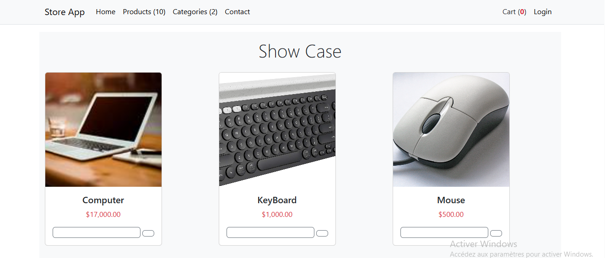
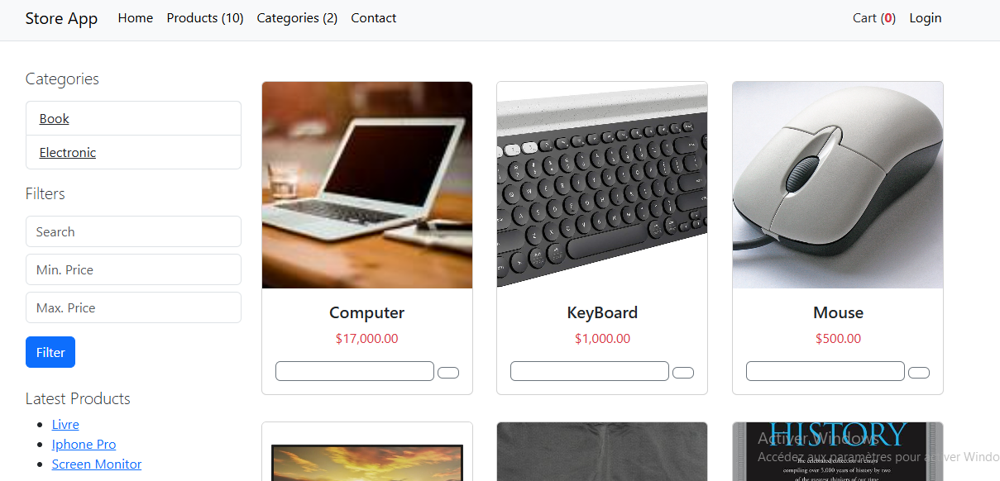

# E-Commerce web Application
This project has been done through my course in BTK Akademi online Plateforme

## Technologies that have been used during the developement of this web app

#####  1_ ASP.NET CORE MVC 
##### 2_ Bootstrap
##### 3_ Html
##### 4_ Entity Framework- Code First

###### Home

You can see in this page we have the show case(it seems like i've issue with my font-awesome icons-because that is not what we was expecting to see)
###### Products

###### Carts

###### Access Denied

As you can see, before i've tried to acces the Admin Page, and since for now i'm not the administrator the access has been denied
###### Admin- Dashboard

You can see at the top of this page, it says i'm now the administrator and so i can naviguate through this admin side
###### Admin -Products

We have the ability to filter these products by the indicated parameters
###### Admin- Categories

###### Admin - Orders

